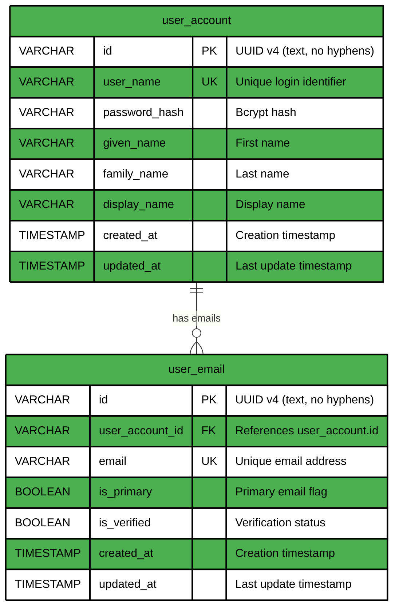

# Data Model Changes: 1.init-project

**Created**: 2026-03-21
**Target Domain(s)**: auth

## Summary of Changes

This spec introduces the initial database schema for the ana-auth service. Two new tables are created: `user_account` for storing user identity and authentication data, and `user_email` for managing user email addresses (supporting multiple emails per user with primary/verified flags). A master admin user is seeded idempotently. Schema-based multitenancy uses PostgreSQL schemas prefixed with `ana-auth-`.

## Affected Domains

---

## auth Domain

### Overview

The auth domain manages user identity for the SSO/OAuth authentication service. It stores user accounts with authentication credentials and associated email addresses. This is a new domain -- no existing tables are modified.

### Mermaid Diagram



### New Tables

#### user_account

| Field | Type | Constraints | Description |
| ----- | ---- | ----------- | ----------- |
| id | VARCHAR(255) | PRIMARY KEY, DEFAULT gen_random_uuid()::text (no hyphens) | UUID v4 unique identifier |
| user_name | VARCHAR(255) | NOT NULL, UNIQUE | Login username |
| password_hash | VARCHAR(255) | NOT NULL | Bcrypt password hash |
| given_name | VARCHAR(255) | NOT NULL | User's first/given name |
| family_name | VARCHAR(255) | NOT NULL | User's last/family name |
| display_name | VARCHAR(255) | NOT NULL | Display name shown in UI |
| created_at | TIMESTAMP | NOT NULL, DEFAULT CURRENT_TIMESTAMP | Record creation time |
| updated_at | TIMESTAMP | NOT NULL, DEFAULT CURRENT_TIMESTAMP | Last modification time |

#### user_email

| Field | Type | Constraints | Description |
| ----- | ---- | ----------- | ----------- |
| id | VARCHAR(255) | PRIMARY KEY, DEFAULT gen_random_uuid()::text (no hyphens) | UUID v4 unique identifier |
| user_account_id | VARCHAR(255) | NOT NULL, FOREIGN KEY -> user_account.id ON DELETE CASCADE | Owning user account |
| email | VARCHAR(255) | NOT NULL, UNIQUE | Email address |
| is_primary | BOOLEAN | NOT NULL, DEFAULT FALSE | Whether this is the primary email |
| is_verified | BOOLEAN | NOT NULL, DEFAULT FALSE | Whether the email has been verified |
| created_at | TIMESTAMP | NOT NULL, DEFAULT CURRENT_TIMESTAMP | Record creation time |
| updated_at | TIMESTAMP | NOT NULL, DEFAULT CURRENT_TIMESTAMP | Last modification time |

### Modified Tables

None -- this is the initial schema.

### Enumeration Definitions

None for this initial schema.

### Business Rules

1. **Unique username**: Each user_account MUST have a unique user_name across the schema.
2. **Unique email**: Each email address MUST be unique across the schema (no two users can share an email).
3. **One primary email**: Each user_account SHOULD have exactly one user_email with is_primary = TRUE.
4. **Admin user idempotent**: The master admin user (user_name: stenvala) MUST be created via INSERT ... ON CONFLICT DO NOTHING so repeated execution is safe.
5. **UUID format**: IDs MUST be generated as UUID v4 with hyphens removed (REPLACE(gen_random_uuid()::text, '-', '')).
6. **Cascade delete**: Deleting a user_account MUST cascade to delete all associated user_email records.

### Relationships

- **user_account_id** -> user_account.id: Many-to-one (each user_email belongs to one user_account)

### Migration Notes

```sql
-- Initial schema creation (create_schema.sql)
CREATE TABLE IF NOT EXISTS user_account (
    id VARCHAR(255) PRIMARY KEY DEFAULT REPLACE(gen_random_uuid()::text, '-', ''),
    user_name VARCHAR(255) NOT NULL UNIQUE,
    password_hash VARCHAR(255) NOT NULL,
    given_name VARCHAR(255) NOT NULL,
    family_name VARCHAR(255) NOT NULL,
    display_name VARCHAR(255) NOT NULL,
    created_at TIMESTAMP NOT NULL DEFAULT CURRENT_TIMESTAMP,
    updated_at TIMESTAMP NOT NULL DEFAULT CURRENT_TIMESTAMP
);

CREATE TABLE IF NOT EXISTS user_email (
    id VARCHAR(255) PRIMARY KEY DEFAULT REPLACE(gen_random_uuid()::text, '-', ''),
    user_account_id VARCHAR(255) NOT NULL REFERENCES user_account(id) ON DELETE CASCADE,
    email VARCHAR(255) NOT NULL UNIQUE,
    is_primary BOOLEAN NOT NULL DEFAULT FALSE,
    is_verified BOOLEAN NOT NULL DEFAULT FALSE,
    created_at TIMESTAMP NOT NULL DEFAULT CURRENT_TIMESTAMP,
    updated_at TIMESTAMP NOT NULL DEFAULT CURRENT_TIMESTAMP
);

-- Master admin user (ensure_admin.sql)
INSERT INTO user_account (id, user_name, password_hash, given_name, family_name, display_name)
VALUES (
    REPLACE(gen_random_uuid()::text, '-', ''),
    'stenvala',
    '$2b$12$PRE_COMPUTED_HASH_HERE',
    'Admin',
    'User',
    'Admin'
) ON CONFLICT (user_name) DO NOTHING;

INSERT INTO user_email (id, user_account_id, email, is_primary, is_verified)
SELECT
    REPLACE(gen_random_uuid()::text, '-', ''),
    ua.id,
    'admin@auth.mathcodingclub.com',
    TRUE,
    TRUE
FROM user_account ua
WHERE ua.user_name = 'stenvala'
AND NOT EXISTS (
    SELECT 1 FROM user_email ue WHERE ue.user_account_id = ua.id
);
```

---

## Merge Instructions

- [ ] Create `ana-speksi/truth/data-models/auth.md` with the auth domain content
- [ ] Update Mermaid diagrams in the auth domain file
