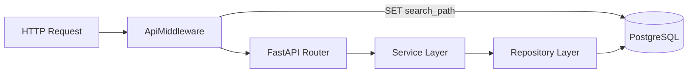

# Technical Specification: Backend Skeleton

**Domain**: auth/backend-skeleton
**Last updated**: 2026-03-24

## Overview

The FastAPI backend uses an application factory pattern with middleware for request-scoped database sessions and schema-based multitenancy. SQLModel is the ORM layer.

## Relevant Skills

| Skill | Why Relevant |
|-------|-------------|
| backend-router | Governs how FastAPI routers are structured with DTOs and dependency injection |
| backend-service | Governs service class patterns for business logic |
| database-repository | Governs repository pattern for database operations |
| database-model | Governs SQLModel class definitions |

## Architecture

Key components:
- `src/api/main.py` -- `create_app()` factory with lifespan, middleware, routers
- `src/api/middleware.py` -- `ApiMiddleware` for request-scoped DB sessions
- `src/shared/db/context.py` -- `DBContext` class managing schema selection via `SET search_path`
- `src/shared/config.py` -- Configuration loading from environment/YAML
- `src/api/routers/health.py` -- Health check router

## Data Model

See [auth data model](../../data-models/auth.md).

## Key Implementation Patterns

1. **Schema selection**: `DBContext` sets `search_path` to `ana-auth-{suffix}` at session creation, isolating tenants at the database level.
2. **Middleware session management**: `ApiMiddleware` creates a DB session per request, commits on success, rolls back on exception.
3. **X-Schema header**: Allows test code to override the schema suffix for isolated test execution.
4. **Gunicorn + uvicorn**: Production uses Gunicorn as process manager with uvicorn workers.
