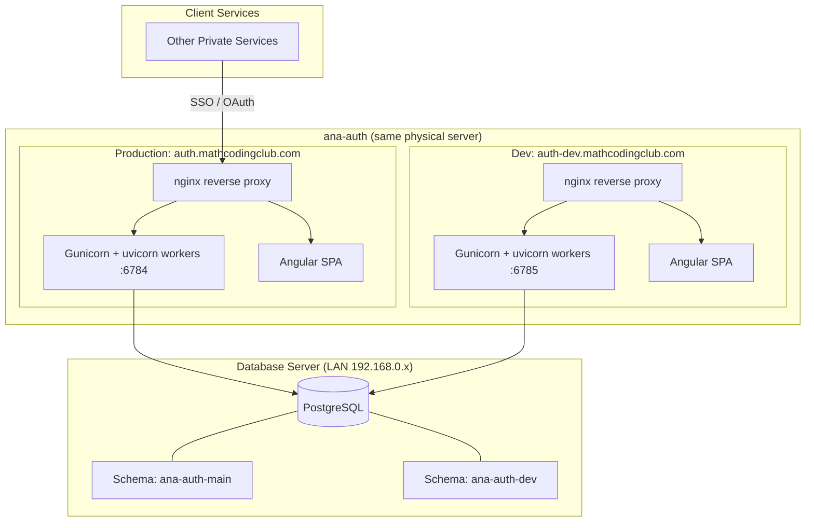

# Platform Architecture

**Last updated**: 2026-03-24

## Overview

ana-auth is a private SSO/OAuth authentication service -- a self-hosted alternative to AWS Cognito or Microsoft Entra ID. It provides centralized authentication for multiple private services, handling user management, JWT signing, token management, and user consent.

## System Diagram



## Technology Stack

| Layer | Technology | Version |
|-------|-----------|---------|
| Backend | Python + FastAPI | 3.13 |
| Frontend | Angular + Angular Material | 21 |
| Database | PostgreSQL | 15 |
| Package Manager (Python) | uv | latest |
| Package Manager (Node) | npm via nvm | Node 20.19.2 |
| ORM | SQLModel | latest |
| Process Manager | Gunicorn + uvicorn | latest |
| Reverse Proxy | nginx | latest |
| SSL | Let's Encrypt / certbot | latest |
| Build/Deploy | MCC pipeline (mcc_build.py, mcc_deploy.py) | custom |

## Project Structure

```
src/
  api/           # FastAPI backend (routers, middleware, main app)
  shared/        # Database models, config, DB connection logic
    db/
      schema/    # SQL schema files (create_schema.sql, ensure_admin.sql)
      migrations/ # SQL migration files
  ui/            # Angular 21 frontend
  tests/         # Backend tests (unit/, integration/, e2e/)
```

## Deployment Topology

Both production and development stages run on the same physical Linux server.

| Aspect | Production | Development |
|--------|-----------|-------------|
| Domain | auth.mathcodingclub.com | auth-dev.mathcodingclub.com |
| Deploy path | live/auth/ | live/auth-dev/ |
| Backend port | 6784 | 6785 |
| DB schema | ana-auth-main | ana-auth-dev |
| Systemd service | ana-auth.service | ana-auth-dev.service |
| Cron jobs | Yes (backups) | No |

## Cross-Cutting Concerns

### Schema-Based Multitenancy

PostgreSQL schema isolation is used for all environments. Schema names follow the pattern `ana-auth-{suffix}` where suffix is `main`, `dev`, `e2e`, or `test-{uuid}`. The backend selects the schema via `SET search_path` at the start of each request, controlled by the `SCHEMA_SUFFIX` environment variable (overridable via `X-Schema` header in test mode).

### Database Migrations

Migrations are tracked via a `_deployment_log` table within each schema. Each migration file's checksum is recorded to prevent redundant execution and detect tampering.

### Configuration

Stage-specific configuration via YAML files (`mcc/conf-prod.yml`, `mcc/conf-dev.yml`) with template variable substitution.

### Automated Backups

Daily pg_dump backups for production only, compressed with gzip. Retention: 30 rolling daily + last day of each month for 12 months. Managed via marker-based crontab entries (MCC-AUTH prefix).
